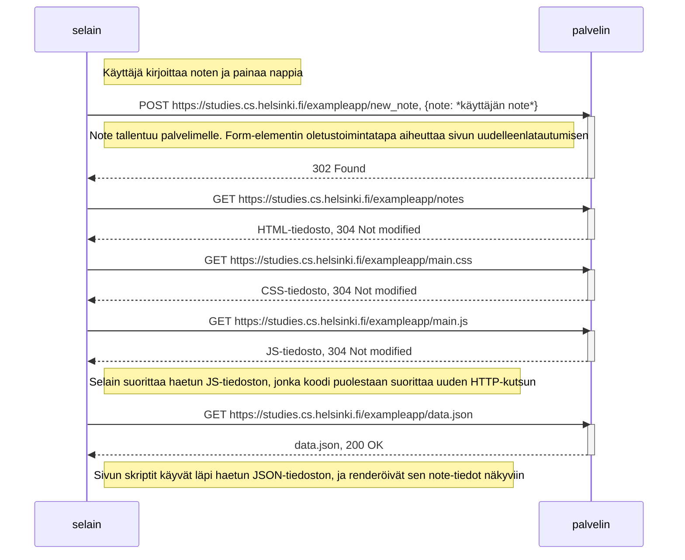

```mermaid
sequenceDiagram
    participant selain
    participant palvelin

    Note right of selain: Käyttäjä kirjoittaa noten ja painaa nappia
    selain->>palvelin: POST https://studies.cs.helsinki.fi/exampleapp/new_note, {note: *käyttäjän note*}
    activate palvelin
    Note left of palvelin: Note tallentuu palvelimelle. Form-elementin oletustoimintatapa aiheuttaa sivun uudelleenlatautumisen
    palvelin-->>selain: 302 Found
    deactivate palvelin

    selain->>palvelin: GET https://studies.cs.helsinki.fi/exampleapp/notes
    activate palvelin
    palvelin-->>selain: HTML-tiedosto, 304 Not modified
    deactivate palvelin

    selain->>palvelin: GET https://studies.cs.helsinki.fi/exampleapp/main.css
    activate palvelin
    palvelin-->>selain: CSS-tiedosto, 304 Not modified
    deactivate palvelin

    selain->>palvelin: GET https://studies.cs.helsinki.fi/exampleapp/main.js
    activate palvelin
    palvelin-->>selain: JS-tiedosto, 304 Not modified
    deactivate palvelin

    Note right of selain: Selain suorittaa haetun JS-tiedoston, jonka koodi puolestaan suorittaa uuden HTTP-kutsun
    selain->>palvelin: GET https://studies.cs.helsinki.fi/exampleapp/data.json
    activate palvelin
    palvelin-->>selain: data.json, 200 OK
    deactivate palvelin

    Note right of selain: Sivun skriptit käyvät läpi haetun JSON-tiedoston, ja renderöivät sen note-tiedot näkyviin
```