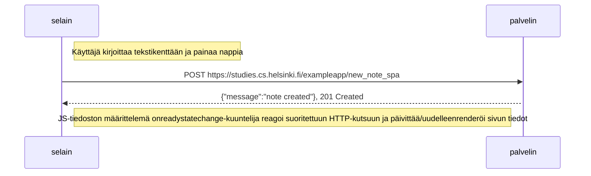

```mermaid
    sequenceDiagram
        participant selain
        participant palvelin

        Note right of selain: Käyttäjä kirjoittaa tekstikenttään ja painaa nappia
        selain ->> palvelin: POST https://studies.cs.helsinki.fi/exampleapp/new_note_spa
        activate palvelin
        palvelin -->> selain: {"message":"note created"}, 201 Created
        Note right of selain: JS-tiedoston määrittelemä onreadystatechange-kuuntelija reagoi suoritettuun HTTP-kutsuun ja päivittää/uudelleenrenderöi sivun tiedot
```