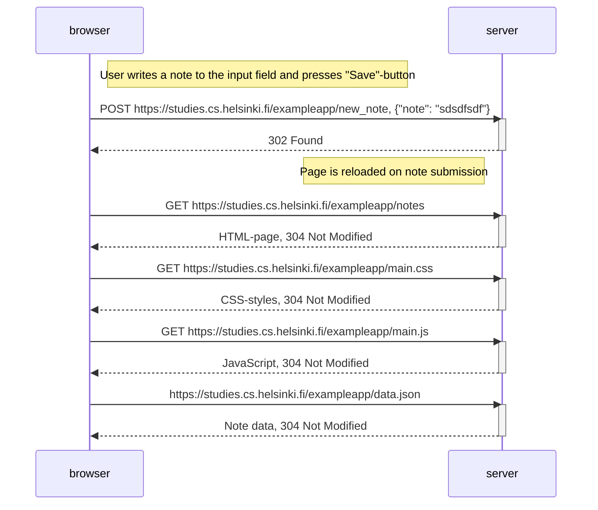

```mermaid
sequenceDiagram
    participant browser
    participant server

    Note right of browser: User writes a note to the input field and presses "Save"-button
    
    browser->>server: POST https://studies.cs.helsinki.fi/exampleapp/new_note, {"note": "sdsdfsdf"}
    activate server
    server-->>browser: 302 Found
    deactivate server

    Note left of server: Page is reloaded on note submission
    
    browser->>server: GET https://studies.cs.helsinki.fi/exampleapp/notes
    activate server
    server-->>browser: HTML-page, 304 Not Modified
    deactivate server

    browser->>server: GET https://studies.cs.helsinki.fi/exampleapp/main.css
    activate server
    server-->>browser: CSS-styles, 304 Not Modified
    deactivate server

    browser->>server: GET https://studies.cs.helsinki.fi/exampleapp/main.js
    activate server
    server-->>browser: JavaScript, 304 Not Modified
    deactivate server

    browser->>server: https://studies.cs.helsinki.fi/exampleapp/data.json
    activate server
    server-->>browser: Note data, 304 Not Modified
    deactivate server
```