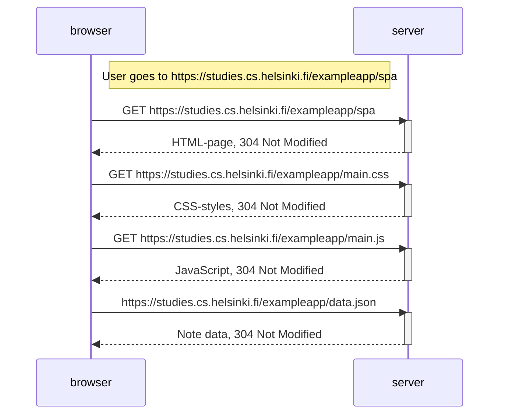

```mermaid
sequenceDiagram
    participant browser
    participant server

    Note right of browser: User goes to https://studies.cs.helsinki.fi/exampleapp/spa
        
    browser->>server: GET https://studies.cs.helsinki.fi/exampleapp/spa
    activate server
    server-->>browser: HTML-page, 304 Not Modified
    deactivate server

    browser->>server: GET https://studies.cs.helsinki.fi/exampleapp/main.css
    activate server
    server-->>browser: CSS-styles, 304 Not Modified
    deactivate server

    browser->>server: GET https://studies.cs.helsinki.fi/exampleapp/main.js
    activate server
    server-->>browser: JavaScript, 304 Not Modified
    deactivate server

    browser->>server: https://studies.cs.helsinki.fi/exampleapp/data.json
    activate server
    server-->>browser: Note data, 304 Not Modified
    deactivate server
    

```